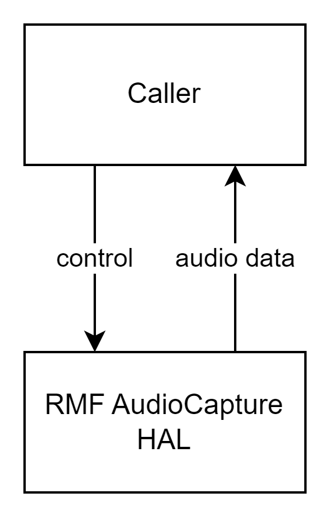
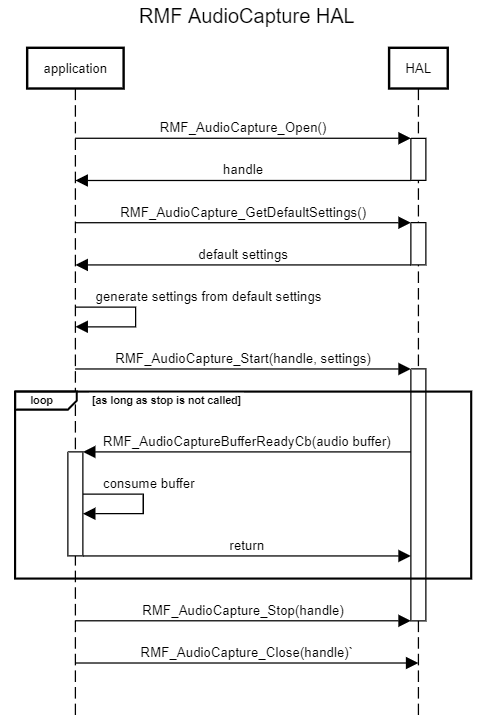
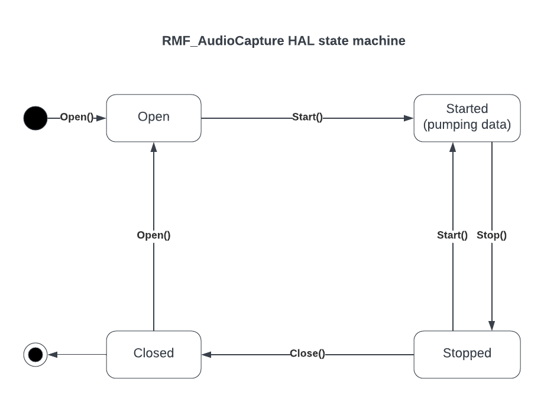

@mainpage

# AudioCapture HAL Documentation

## Version and Version History

| Date (YYYY-mm-dd) | Author | Comment | Version |
| --- | --------- | --- | --- |
| 2023-03-30 | Review team | Updated after review | 1.0.1 |
| 2023-03-27 | Chaithen Sojan | First Release | 1.0.0 |

## Table of Contents

- [Acronyms](#acronyms)
- [Description](#description)
- [Component Runtime Execution Requirements](#component-runtime-execution-requirements)
  - [Initialization and Startup](#initialization-and-startup)
  - [Threading Model](#threading-model)
  - [Process Model](#process-model)
  - [Memory Model](#memory-model)
  - [Power Management Requirements](#power-management-requirements)
  - [Asynchronous Notification Model](#asynchronous-notification-model)
  - [Blocking calls](#blocking-calls)
  - [Internal Error Handling](#internal-error-handling)
  - [Persistence Model](#persistence-model)
- [Non-functional requirements](#non-functional-requirements)
  - [Logging and debugging requirements](#logging-and-debugging-requirements)
  - [Memory and performance requirements](#memory-and-performance-requirements)
  - [Quality Control](#quality-control)
  - [Licensing](#licensing)
  - [Build Requirements](#build-requirements)
  - [Variability Management](#variability-management)
  - [Platform or Product Customization](#platform-or-product-customization)
- [Interface API Documentation](#interface-api-documentation)
  - [Theory of operation](#theory-of-operation)
    - [Architecture Diagram](#architecture-diagram)
    - [Sequence Diagram](#sequence-diagram)
    - [State Diagram](#state-diagram)

## Acronyms, Terms and Abbreviations

- `API` - Application Programming Interface
- `HAL` - Hardware Abstraction layer
- `PCM` - Pulse Code Modulation
- `RDK` - Reference Development Kit
- `RMF` - RDK Media Framework
- `STB` - Set Top Box

## Description

AudioCapture `HAL` must deliver a constant stream of raw audio data (`PCM`) to the caller. The purpose of audio capture is to tap the final mix of the decoded audio. The audio data delivered via this interface is required to track as closely as possible, i. e., minimal latency,
to the audio that's being rendered by the device at a given point of time.
#TODO picture explaining the relationship b/w dcoder, mixer, speaker/HDMI etc.

## Component Runtime Execution Requirements

These requirements ensure that the `HAL` executes correctly within the run-time environment that it will be used in.

### Initialization and Startup

Caller is expected to have complete control over the lifecycle of AudioCapture `HAL` (from open to close).

### Threading Model

This interface is required to be thread-safe and will be invoked from multiple caller threads. Data callback `RMF_AudioCaptureBufferReadyCb()` must originate in a thread that's separate from caller context(s). Caller will not make any `HAL` calls in the context of
`RMF_AudioCaptureBufferReadyCb()` and `RMF_AudioCapture_StatusChangeCb()`.

### Process Model

Caller will take care of AudioCapture `HAL` initialization. The interface is expected to support a single instantiation with a single process.

### Memory Model

AudioCapture `HAL` is responsible for its own memory management. The buffer used for audio data passed by `RMF_AudioCaptureBufferReadyCb()` must be managed
after the callback returns.

### Power Management Requirements

This interface is not required to be involved in any power management funtionality.

### Asynchronous Notification Model

No asynchronous notification is required.

### Blocking calls

The following callbacks may block depending on the caller's internal operations but will endeavour to return as soon as possible.

  1. `RMF_AudioCaptureBufferReadyCb()`
  2. `RMF_AudioCapture_StatusChangeCb()`
 
### Internal Error Handling

All APIs must return errors synchronously as a return argument. The interface is responsible for managing its internal errors.

### Persistence Model

There is no requirement to persist any settings information. The necessary parameters will be passed with `RMF_AudioCapture_Start()` for every audio capture session.

## Non-functional requirements

The following non-functional requirements are required to be supported by this interface:

### Logging and debugging requirements

This interface is required to log all errors, warnings and critical informative messages that are necessary to debug/triage any issues impacting audio capture use cases. It's expected that the interface will use stdout and stderr for logging.

### Memory and performance requirements

This interface is required to use only minimal memory/CPU resources while in closed/stopped state.

### Quality Control

* The implementation is required to perform static analysis, our preferred tool is Coverity.
* Open-source copyright validation is required to be performed, e.g.: Black duck, FossID.
* Have a zero-warning policy with regards to compiling. All warnings are required to be treated as errors.
* Use of memory analysis tools like Valgrind are encouraged, to identify leaks/corruption.
* Tests will endeavour to create worst case scenarios to assist investigations.
* Improvements by any party to the testing suite are required to be fed back.

### Licensing

The AudioCapture header file is released under Apache 2.0 license. The implementation may use any license compatible with the aforementioned header file.

### Build Requirements

This interface is required to build into shared library. The shared library must be named `librmfAudioCapture.so`. The building mechanism must be independent of Yocto.

### Variability Management

Any new `API` introduced should be implemented by all the 3rd party modules. Currently there is little to no variability expected across various implementations. Any change to the interface must be reviewed and approved by component architects and owners.

### Platform or Product Customization

The default settings returned via `RMF_AudioCapture_GetDefaultSettings()` will be configured with parameters that are favourable to the implementation. The caller will typically not change any of these parameters unless strictly necessary.

## Interface API Documentation

`API` documentation is provided via doxygen comments in the header file.

### Theory of operation

Caller will configure AudioCapture interface with the necessary settings and start the capture. `HAL` will deliver audio and status updates
via the registered callbacks in a timely fashion. Calling `RMF_AudioCapture_Open()` is a necessary precondition for the remaining APIs to work.

#### Architecture Diagram

Following is a typical sequence of operation:
1. Open the interface using `RMF_AudioCapture_Open()`.
2. Get default settings using `RMF_AudioCapture_GetDefaultSettings()`. This returns a struct of parameters favourable to the `HAL`. Application may tweak certain members of this struct and pass it with the start call.
3. Start audio capture using `RMF_AudioCapture_Start()`. The interface will continuously deliver audio data to caller in real time via callback `RMF_AudioCaptureBufferReadyCb()`.
4. When the audio stream is no longer needed, stop audio capture using `RMF_AudioCapture_Stop()`. This will stop the 'HAL' callbacks.
5. Close the interface using `RMF_AudioCapture_Close()`.

### Diagrams

#### Operational call sequence

#### State machine of AudioCapture interface

